# diploma-master

[](https://github.com/andinoriel/diploma-master/actions/workflows/lint.yml)

This diploma project designed to interactively demonstrate the key aspects of modern encryption algorithms with an assessment of their effectiveness.

## Usage

1. Install [Docker](https://docs.docker.com/engine/installation/), [Docker Compose](https://docs.docker.com/compose/install/) and [Task](https://taskfile.dev/#/installation);

2. Clone this project and then cd to the project folder;

3. Run the initial build of the environment:
```sh
$ task init
```

4. Now you just need to run the application:
```sh
$ task run
```

5. After finishing work, you can stop running containers:
```sh
$ task stop # to just stop running application
$ task down # also stop and remove containers
```

## Screenshots

<details>
  <summary>Expand</summary>

  <p align="center">
    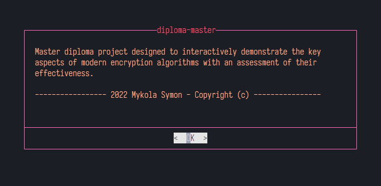
    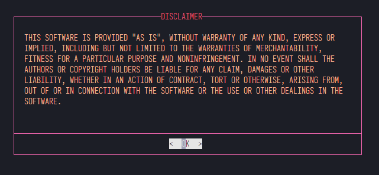
    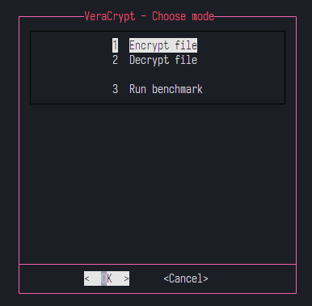
    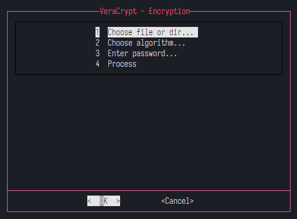
    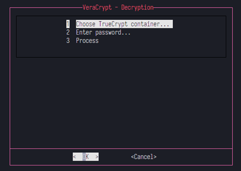
    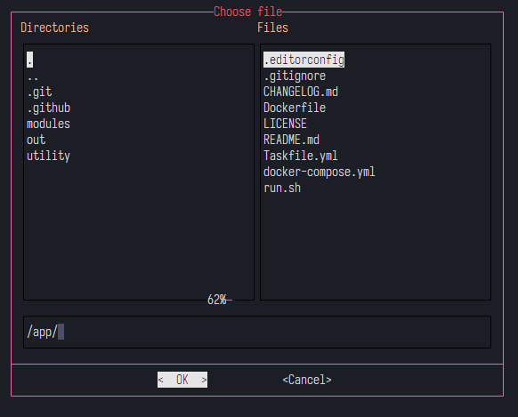
    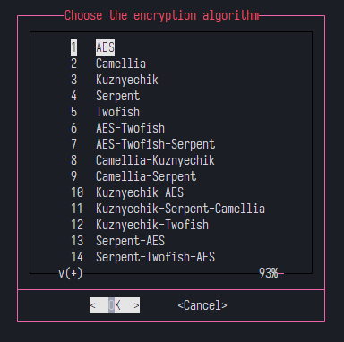
    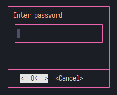
    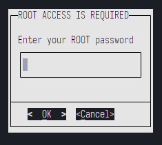
    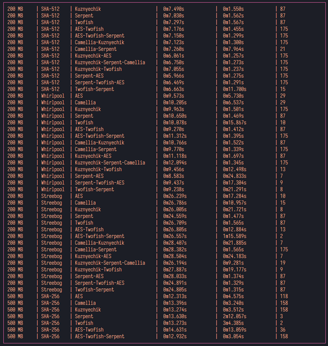
    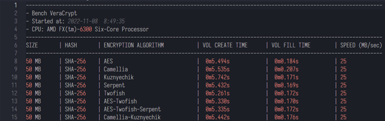
    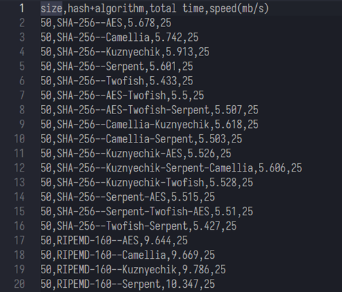
    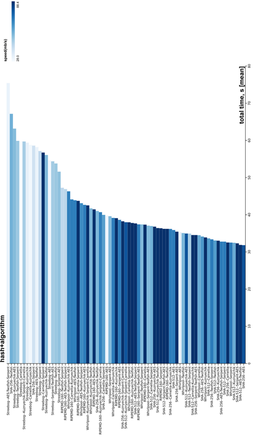
    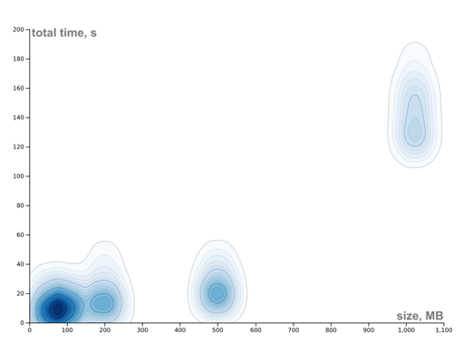
    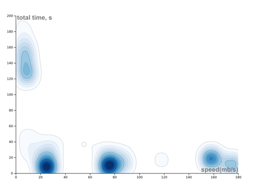
    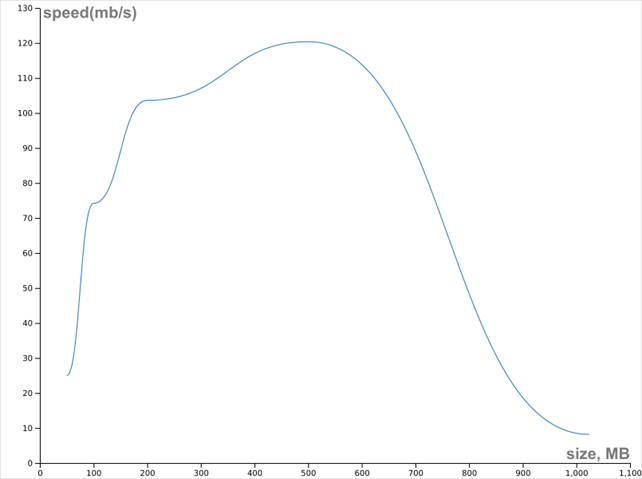
    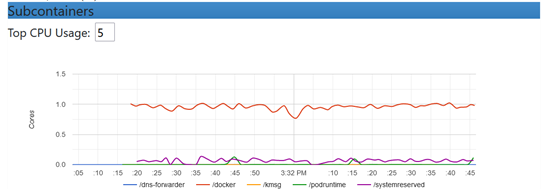
    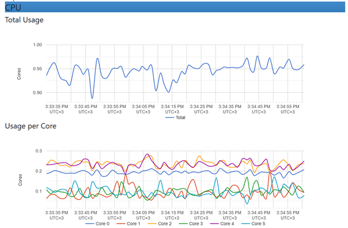
  </p>
</details>

## Samples

For the examples of finished csv and bench report see [csv](samples/data2022-11-08_08-49-35.csv), [log](samples/vcbench2022-11-08_08-49-35.log).

## Credits

My thanks to the developers of the [Docker](https://www.docker.com/company), [Bash](https://www.gnu.org/software/bash/) and [VeraCrypt](https://www.veracrypt.fr/code/VeraCrypt/).

## License

This project is licensed under the [MIT License](LICENSE).
